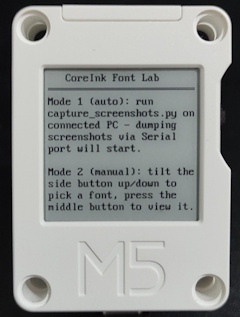
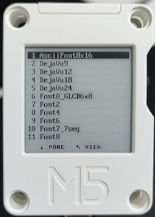
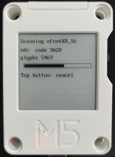
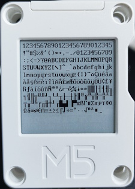
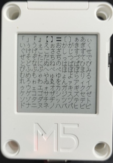
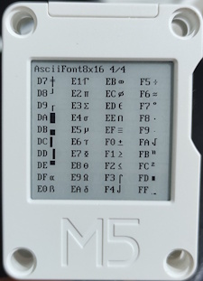
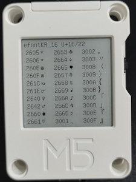
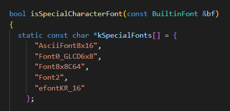
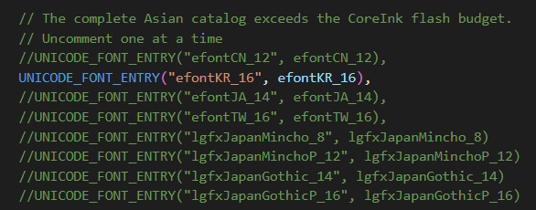
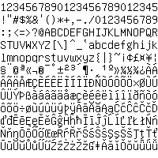

# CoreInk Font Lab

An Arduino sketch for the M5Stack CoreInk that walks every built-in M5GFX
font, detects which characters actually render visible pixels, and prints
them page by page on the screen. I concentrated on Latin ASCII fonts, however
Unicode fonts such as Japanese IPA fonts, and Chinese, Japanese, Korean, and Traditional Chinese
efonts are also available on M5GFX. Unicode fonts are large and you generealy 
can fit at most one such font at a time into CoreInk flash memory.

The app implements two modes:

- **Mode 1 (automatic capture)**: every listed font is scanned and each
  filled page is streamed to a connected PC as a BMP screenshot over serial.
  User needs to run python script on connected PC to initiate the capture process.
- **Mode 2 (manual browse)**: use the buttons to page through fonts on the
  device screen itself, no connnected PC required.



## Hardware

- M5Stack CoreInk
- USB-C cable to your PC (Mode 1 needs active connection; Mode 2 works standalone once app flashed to device)

## Mode 1: automatic capture

1. On boot, the device shows the welcome/instructions screen and waits for a
   PC-side READY handshake.
2. Start `capture_screenshots.py` on your PC (see below). The script opens
   the serial port, suppresses the reset-signaling lines that can restart
   the CoreInk, waits a short moment for the board to finish booting, and
   sends `READY`.
3. Once the device sees `READY`, it enters the auto-dump flow and begins the
   full font scan without waiting for a button press.
4. For each configured font, the device:
   - Detects every printable character by drawing each one into an
     off-screen RAM buffer and checking whether it actually drew any pixels —
     non-printable/undefined glyphs are skipped automatically. Latin fonts
     are scanned from codepoint 33 through 255; Unicode fonts are scanned
     across the full Unicode range (codepoints 32 through 65535).
   - Lays printable characters out on the screen, filling row after row and
     page after page without truncating characters.
   - Page 1 of each font also shows a repeating `1234567890` row 
     (giving visual indication of how many characters fit in one line); continuation
     pages skip that header to maximize character density (the filename
     already identifies the font/page).
   - For the handful of fonts that also get a character table (see below),
     streams the table page(s) too, right after the running-text pages.
   - Streams each filled page to the PC over serial as a BMP and waits for an
     acknowledgement before continuing. Script stores pages into /captures/ subfolder.
5. Once every configured font has been captured, the device sends a
   completion signal and shows a "Done" screen before powering down. 
   The script exits too.

## Mode 2: manual browse

If no PC sends `READY`, pressing any button from the welcome screen enters
Mode 2 instead.



- Tilt the side button up/down to scroll the font list, press the middle
  button to open the selected font.
- Unicode fonts scan the full codepoint range before they can be displayed,
  so opening one first shows a progress screen; press the top button to
  cancel the scan and return to the list.

  
- Once open, use the side buttons to page through the font's content —
  running-text pages, and (for a handful of fonts, see below) character
  table pages — and the middle button to close back to the font list.

  
  

## Character tables (available in both modes)

Most fonts only ever show plain running-text pages, but a handful of fonts
also get a character table page: the hex code for each glyph next to the
glyph itself, laid out in a grid. This applies in **both** Mode 1 (the table
page is streamed as an extra BMP alongside the running-text pages) and
Mode 2 (the table page is just another page you can browse to).




Which fonts get the table view is controlled by the `kSpecialFonts[]` list
inside `isSpecialCharacterFont()` in `CoreInk_FontLab/PageLayout.cpp` — to
see the table for another built-in font, add its exact `name` string (as
used in `kBuiltinFonts[]`) to that list and reflash.



## Unicode fonts are opt-in

Unicode fonts (the `efont*`/`lgfxJapan*` families) are opt-in: each one is
added to `kBuiltinFonts[]` in `CoreInk_FontLab/FontRegistry.cpp` via a
`UNICODE_FONT_ENTRY(...)` line. A full Unicode scan (codepoints 32 through
65535) is slow and the CoreInk doesn't have the flash budget to hold every
Asian font at once, so only uncomment one `UNICODE_FONT_ENTRY` line at a
time, re-comment the rest, and reflash to capture/browse that font.



These fonts are available at different sizes, e.g. efontKR_12, efontKR_14, efontKR_16.

## Flashing the sketch

1. Open [CoreInk_FontLab/CoreInk_FontLab.ino](CoreInk_FontLab/CoreInk_FontLab.ino)
   in the Arduino IDE.
2. Install the required libraries (via Library Manager) if you don't have
   them: `M5Unified`, `M5GFX`.
3. Select board **M5Stack-CoreInk** and the correct COM port.
4. Upload the sketch.

## Running Mode 1 (`capture_screenshots.py`)

### Install

Requires Python 3.9+ and [pyserial](https://pypi.org/project/pyserial/):

```powershell
pip install pyserial
```

### Usage

1. Make sure no other program (Arduino Serial Monitor, etc.) has the COM port
   open.
2. Find your CoreInk's COM port (Device Manager on Windows).
3. Run the script. It will open the serial port, signal `READY`, and wait for
   the device to begin the dump.

   ```powershell
   python capture_screenshots.py COM4
   ```

4. The device should transition from the welcome screen into the auto-dump
   process without requiring a button press. The script prints a line for every
   BMP saved, and a final summary when the device signals it's done — then it
   exits automatically.

### Options

```powershell
python capture_screenshots.py <PORT> [--baud 115200] [--out-dir captures]
```

- `--baud`: serial baud rate (must match the sketch, default `115200`).
- `--out-dir`: directory to save BMP files into (default `captures/`).

### Filenames

- Single-page fonts: `<FontName>.bmp` (e.g. `DejaVu18.bmp`).
- Multi-page fonts: `<FontName>_page1.bmp`, `<FontName>_page2.bmp`, ...

## Captured screenshots

The [`screenshots/`](screenshots/) folder contains the BMP pages produced by a
capture run. A few examples:




The full captured gallery is in [captured-screenshots.md](captured-screenshots.md).

## Troubleshooting

- **Device jumps back to the welcome screen after the script starts**: the PC-side
  serial port is likely toggling DTR/RTS and restarting the CoreInk. The script
  now disables those control lines and waits briefly before sending `READY`.
- **Device shows "ERROR: SCRIPT not responding"**: the script isn't running,
  isn't connected to the right COM port, or the PC couldn't keep up — restart
  the script and reset the device.
- **`Error: could not open port`**: another program is still holding the COM
  port open — close it first.
- **Wrong/garbled image**: make sure `--baud` matches the sketch's baud rate.
