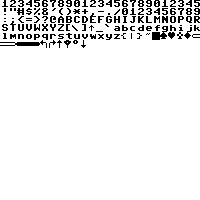
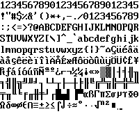

# CoreInk Font Lab

An Arduino sketch for the M5Stack CoreInk that automatically walks every
built-in M5GFX font, detects which characters actually render visible pixels,
and prints them page by page on the screen — streaming each filled page to a
PC-side Python script as a BMP screenshot over serial.


## Hardware

- M5Stack CoreInk
- USB-C cable to your PC

## How it works

1. On boot, the device shows the welcome/instructions screen and waits for a
   PC-side READY handshake.
2. Start `capture_screenshots.py` on your PC. The script opens the serial port,
   suppresses the reset-signaling lines that can restart the CoreInk, waits a
   short moment for the board to finish booting, and sends `READY`.
3. Once the device sees `READY`, it enters the auto-dump flow and begins the
   full font scan without waiting for a button press.
4. For each built-in font, the device:
   - Detects every printable character (codepoints 33–255) by drawing each
     one into an off-screen RAM buffer and checking whether it actually drew
     any pixels — non-printable/undefined glyphs are skipped automatically.
   - Lays printable characters out on the screen, filling row after row and
     page after page without truncating characters.
   - Page 1 of each font also shows a repeating `1234567890` row; continuation
     pages skip that header to maximize character density (the filename already
     identifies the font/page).
   - Streams each filled page to the PC over serial as a BMP and waits for an
     acknowledgement before continuing.
5. Once every font has been captured, the device sends a completion signal and
   shows a "Done" screen before powering down.

## Flashing the sketch

1. Open [CoreInk_FontLab/CoreInk_FontLab.ino](CoreInk_FontLab/CoreInk_FontLab.ino)
   in the Arduino IDE.
2. Install the required libraries (via Library Manager) if you don't have
   them: `M5Unified`, `M5GFX`.
3. Select board **M5Stack-CoreInk** and the correct COM port.
4. Upload the sketch.

## Running the capture (`capture_screenshots.py`)

### Install

Requires Python 3.9+ and [pyserial](https://pypi.org/project/pyserial/):

```powershell
pip install pyserial
```

### Usage

1. Make sure no other program (Arduino Serial Monitor, etc.) has the COM port
   open.
2. Find your CoreInk's COM port (Device Manager on Windows).
3. Run the script. It will open the serial port, signal `READY`, and wait for
   the device to begin the dump.

   ```powershell
   python capture_screenshots.py COM4
   ```

4. The device should transition from the welcome screen into the auto-dump
   process without requiring a button press. The script prints a line for every
   BMP saved, and a final summary when the device signals it's done — then it
   exits automatically.

### Options

```powershell
python capture_screenshots.py <PORT> [--baud 115200] [--out-dir captures]
```

- `--baud`: serial baud rate (must match the sketch, default `115200`).
- `--out-dir`: directory to save BMP files into (default `captures/`).

### Filenames

- Single-page fonts: `<FontName>.bmp` (e.g. `DejaVu18.bmp`).
- Multi-page fonts: `<FontName>_page1.bmp`, `<FontName>_page2.bmp`, ...

## Captured screenshots

The [`screenshots/`](screenshots/) folder contains the BMP pages produced by a
capture run. A few examples:





The full captured gallery is in [captured-screenshots.md](captured-screenshots.md).

## Troubleshooting

- **Device jumps back to the welcome screen after the script starts**: the PC-side
  serial port is likely toggling DTR/RTS and restarting the CoreInk. The script
  now disables those control lines and waits briefly before sending `READY`.
- **Device shows "ERROR: SCRIPT not responding"**: the script isn't running,
  isn't connected to the right COM port, or the PC couldn't keep up — restart
  the script and reset the device.
- **`Error: could not open port`**: another program is still holding the COM
  port open — close it first.
- **Wrong/garbled image**: make sure `--baud` matches the sketch's baud rate.
